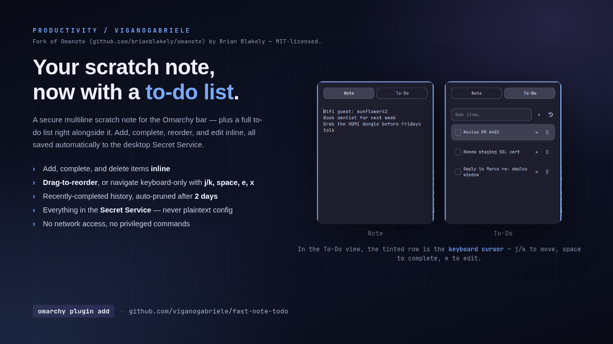

# Fast Note Todo

[](LICENSE)

Fast Note Todo adds a secure multiline scratch note *and* a to-do list to the
Omarchy bar — one icon next to the clock, saving both automatically.



(Screenshots use placeholder example content, not real notes.)

## Credit

This is a fork of [Omanote](https://github.com/brianblakely/omanote) by
Brian Blakely (MIT-licensed) — the note view, its Secret Service storage,
and the panel plumbing are his. The added To-Do tab (add/complete/delete,
drag-to-reorder, inline editing, keyboard navigation with `j`/`k`/`space`/`e`/`x`,
its own storage field) is new here. See [LICENSE](LICENSE) for the original
copyright notice.

## Install

```bash
omarchy plugin add https://github.com/viganogabriele/fast-note-todo.git --enable --yes
```

## Security

Notes and to-dos are stored in the desktop Secret Service rather than
`~/.config/omarchy/shell.json`. Automatic saves use a randomly named file in the
user runtime directory and delete it immediately afterward. The keyring
attribute is still `b.omanote` (the pre-fork plugin id) so a note saved
before the fork stays reachable after upgrading.

## Update

```bash
omarchy plugin update io.github.viganogabriele.fast-note-todo
```

## Uninstall

```bash
omarchy plugin remove io.github.viganogabriele.fast-note-todo
```
