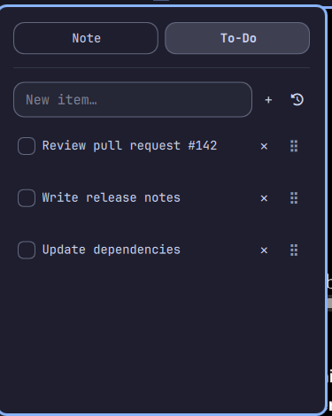

# Fast Note Todo

[](LICENSE)

Fast Note Todo adds a secure multiline scratch note *and* a to-do list to the
Omarchy bar, and saves both automatically.




(Both screenshots use placeholder example content, not real notes.)

## Credit

This is a fork of [Omanote](https://github.com/brianblakely/omanote) by
Brian Blakely (MIT-licensed) — the note view, its Secret Service storage,
and the panel plumbing are his (`preview.png` above is his original
screenshot). The added To-Do tab (add/complete/delete, drag-to-reorder,
inline editing, its own storage field) is new here. See [LICENSE](LICENSE)
for the original copyright notice.

## Install

```bash
omarchy plugin add https://github.com/viganogabriele/fast-note-todo.git --enable --yes
```

## Shortcuts

```lua
o.bind("SUPER + F8", "Toggle Fast Note Todo", "omarchy-shell shell toggle io.github.viganogabriele.fast-note-todo")
o.bind("SUPER + ALT + F8", "Open Fast Note Todo", "omarchy-shell shell summon io.github.viganogabriele.fast-note-todo")
o.bind("SUPER + CTRL + F8", "Close Fast Note Todo", "omarchy-shell shell hide io.github.viganogabriele.fast-note-todo")
```

## Security

Notes and to-dos are stored in the desktop Secret Service rather than
`~/.config/omarchy/shell.json`. Automatic saves use a randomly named file in the
user runtime directory and delete it immediately afterward. The keyring
attribute is still `b.omanote` (the pre-fork plugin id) so a note saved
before the fork stays reachable after upgrading.

## Update

```bash
omarchy plugin update io.github.viganogabriele.fast-note-todo
```

## Uninstall

```bash
omarchy plugin remove io.github.viganogabriele.fast-note-todo
```
